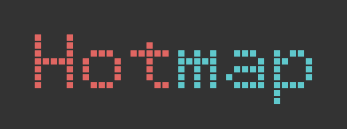

# Hotmap




A WebGL Heatmap Viewer for Bioinformatics and Big Data, written in vanilla JS and built with [pixi.js](http://www.pixijs.com/).

[demo](https://nconrad.github.io/hotmap/demo/)


## Some Features

- panning, scaling, zoom, and resizing
- drag and drop rows/columns
- SVG download
- various color/binning options [to be extended]
- search
- cell/row/column selection
- meta/categorical data display
- update API
- flip axes
- customizable tooltips
- fullscreen button


## Why?

I wanted to create a heatmap viewer that is easy to use and scales to millions of cells.


## Prototype Usage

#### Global

Add the required CSS/JS:

```
<link rel="stylesheet" type="text/css" href="dist/hotmap.css">
<script src="dist/hotmap.js"></script>
```

#### ES6

Add required CSS, and import JS:

```
<link href="dist/hotmap.css" rel="stylesheet" type="text/css">
```

```
import Hotmap from 'dist/hotmap';
```

#### AMD

Add required required CSS, and require:

```
<link href="dist/hotmap.css" rel="stylesheet" type="text/css">
```

```javascript
requirejs.config({
    baseUrl: 'dist',
});

requirejs(['hotmap'], function(Hotmap) {
    ...
})
```

### Basic Example Config

```javascript
    let hotmap = new Hotmap({
        ele: document.getElementById('hotmap'),
        rows: [{...}],
        cols: [{...}],
        matrix: [[1, 2, 3], [2, 5.3, 0], ...],
        // note the following configs are optional
        color: {
            bins: ['=0', '=1', '=2', '<20', '>=20'],
            colors: [0xffffff, 0xfbe6e2, 0xffadad, 0xff6b6b, 0xff0000]
        },
        onHover: info => `<div><b>Genome:</b> ${info.yLabel}</div>`
    })
```

### Config

| Param                 | Type                              | Required? | Default                       |
|-----------------------|-----------------------------------|-----------|-------------------------------|
| [rows](#rows)         | list of `row` objects (see below) | &check;   | -                             |
| [cols](#cols)         | list of `col` objects (see below) | &check;   | -                             |
| matrix                | matrix of numbers                 | &check;   | -                             |
| rowsLabel             | string                            | -         | 'Rows'                        |
| colsLabel             | string                            | -         | 'Columns'                     |
| rowMetaLabels         | list of strings                   | -         | []                            |
| colMetaLabels         | list of strings                   | -         | []                            |
| color                 | string \|\| object                | -         | 'gradient'                    |
| [defaults](#defaults) | Object                            | -         | computed based on window size |
| [options](#options)   | Object                            | -         | -                             |


### Event Callbacks

| Param       | Type                  | Required? | Default                                                     |
|-------------|-----------------------|-----------|-------------------------------------------------------------|
| onHover     | function(Object) {}   | -         | Displays row, column, and matrix value in tooltip on hover. |
| onSelection | function([Object]) {} | -         | -                                                           |
| onClick     | function(Object) {}   | -         | -                                                           |

### API Methods

| Method      | Definition                                      | Description                                                |
|-------------|-------------------------------------------------|------------------------------------------------------------|
| update      | update({rows, cols, matrix})                    | Given object with rows, columns, and matrix, updates chart |
| getState    | getState()                                      | Returns current rows, columns and matrix                   |
| flipAxis    | flipAxis()                                      | Swaps rows, cols, labels, and scaling                      |
| downloadSVG | downloadSVG({{fileName = 'hotmap.svg', full}}) | Downloads chart as SVG.  "full" will include all data.     |


##### rows
```javascript
[
    {
        name: 'some label',
        meta: ['cat 1', 'some meta info']
    },
    ...
]
```

##### cols
```javascript
[
    {
        name: 'some label',
        meta: ['cat foo', 'cat bar']
    },
    ...
]
```

##### defaults
```javascript
{
    cellWidth: <initial_width_of_cell_(integer)>,
    cellHeight: <initial_height_of_cell_(integer)>
}
```

##### options
```javascript
{
    maxFontSize: <int>          // in pixels
    hideLegend: false,
    legend: <some_html>,
    hideOptions: false,
    theme: 'dark' | 'light',
    showVersion: false,         // shows version top-right
    maxFontSize: <int>,         // in pixels
    waitForFont: false,         // useful if custom fonts are used
    rowLabelEllipsisPos: <int>, // position to places ellipsis (0-indexed)
    colLabelEllipsisPos: <int>
}
```


## Development

### Local Installation

```
npm install
```


### Development

```
npm start
```


### Build

```
npm run build
```


## Author(s)

[nconrad](https://github.com/nconrad)


## Citation

Please cite this repo in the meantime:

N. Conrad, A WebGL Heatmap Viewer for Bioinformatics and Big Data, (2019), GitHub repository, https://github.com/nconrad/hotmap


## License

Released under [the MIT license](https://github.com/nconrad/hotmap/blob/master/LICENSE).


