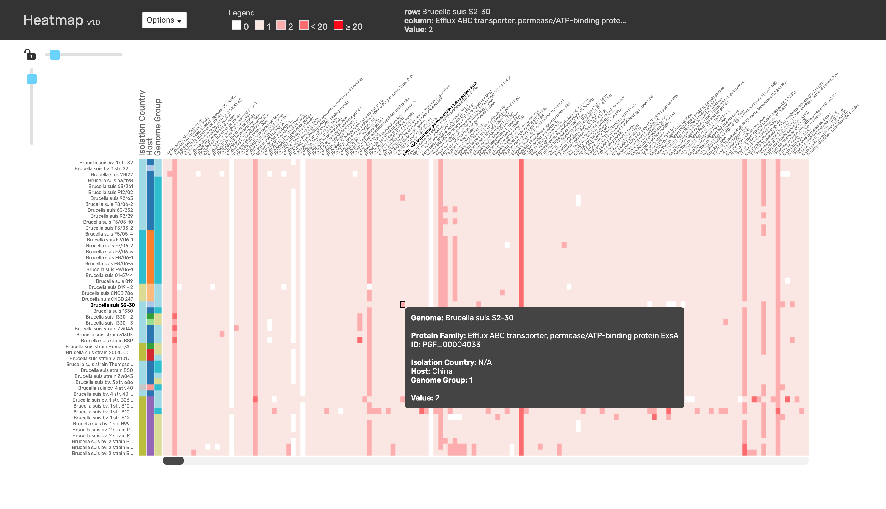

# Heatmap

A WebGL/Canvas Heatmap for Bioinformatics and Big Data, written in vanilla JS and built with [pixi.js](http://www.pixijs.com/).




## Why?

I wanted to create a heatmap viewer that easy to use and scales to millions of cells.  The applications in bioinfomatics are endless.


## Usage

Currently requires:

```
npm install 
npm build
```


### Basic Usage

```
    <script src="../../dist/heatmap.js"></script>
    ...
    <body>
        <div id="heatmap"></div>
    </body>
```

```javascript
 let chart = new Heatmap({
    ele: document.getElementById('heatmap'), 
    rows: [...] 
    cols: [...], 
    matrix: [[...], [...], ...]
 })
```


### Config

| Param  | Type                                                                                           | Required? | Default    |
|--------|------------------------------------------------------------------------------------------------|-----------|------------|
| rows   | list of rows objects:<br> `[{name: 'label 1'}, ...}]`                                          | &check;   | -       |
| cols   | list of col objects:<br> `[{name: 'label 1'}, ...}]`                                           | &check;   | -       |
| matrix | matrix of values:<br> `[[1,2,3], [2,5.3,0], ...]`                                              | &check;   | -       |
| color  | string \|\| object<br> Ex:<br> ```{bins: ["=0", "=1", "<50", ">50"], colors: [0x22222,...]}``` | optional  | 'gradient' |
| onHover | function | optional | Displays row, column, and matrix value in tooltip on hover. |


### API Methods

| Method   | Definition                   | Description                                                |
|----------|------------------------------|------------------------------------------------------------|
| update   | update({rows, cols, matrix}) | Given object with rows, columns, and matrix, updates chart |
| getState | getState()                   | Returns current rows, columns and matrix                   |


### Example config

```javascript
    let heatmap = new Heatmap({
        ele: document.querySelector('chart'),
        rows: [{...}],
        cols: [{...}],
        matrix: [[1,2,3], 2,5.3,0], ...],
        color: {
            bins: ['=0', '=1', '=2', '<20', '>=20'],
            colors: [0xffffff, 0xfbe6e2, 0xffadad, 0xff6b6b, 0xff0000]
        },
        onHover: info => {
            return `<div><b>Genome:</b> ${info.yLabel}</div><br>`
        }
    })
```


## Development

### Local Installation

```
npm install
```


### Development

```
npm start
```

### Build

```
npm run build
```


## Author(s)

Neal Conrad <nconrad@anl.gov>


## Citation

Please cite this repo in the meantime:

N. Conrad, A WebGL Heatmap for Bioinformatics and Big Data, (2019), GitHub repository, https://github.com/nconrad/heatmap


## License

Released under [the MIT license](https://github.com/nconrad/heatmap/blob/master/LICENSE).


